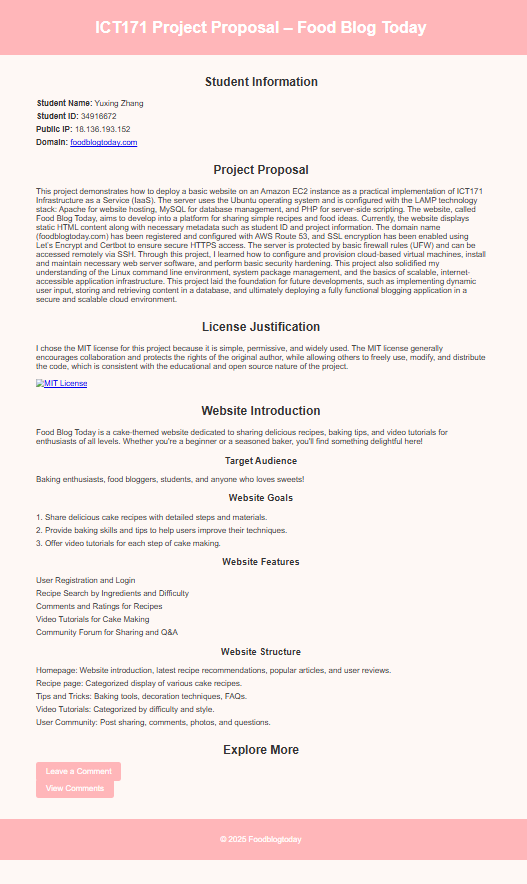
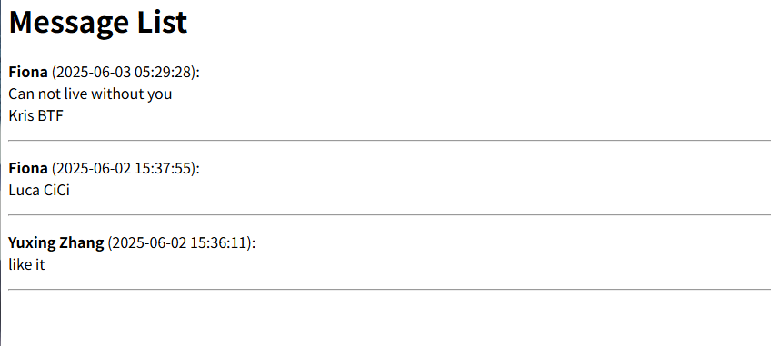

# foodblogtoday
ICT171 Project Proposal – Food Blog Today
🌐 [http://foodblogtoday.com](http://foodblogtoday.com)
## Project Overview
This project demonstrates how to deploy a basic website on an Amazon EC2 instance as a practical implementation of ICT171 Infrastructure as a Service (IaaS). The server uses the Ubuntu operating system and is configured with the LAMP technology stack: Apache for website hosting, MySQL for database management, and PHP for server-side scripting. The website, called Food Blog Today, aims to develop into a platform for sharing simple recipes and food ideas. Currently, the website displays static HTML content along with necessary metadata such as student ID and project information. The domain name (foodblogtoday.com) has been registered and configured with AWS Route 53, and SSL encryption has been enabled using Let’s Encrypt and Certbot to ensure secure HTTPS access. The server is protected by basic firewall rules (UFW) and can be accessed remotely via SSH. Through this project, I learned how to configure and provision cloud-based virtual machines, install and maintain necessary web server software, and perform basic security hardening. This project also solidified my understanding of the Linux command line environment, system package management, and the basics of scalable, internet-accessible application infrastructure. This project laid the foundation for future developments, such as implementing dynamic user input, storing and retrieving content in a database, and ultimately deploying a fully functional blogging application in a secure and scalable cloud environment.

## Server Stack

- **IaaS Provider:** Amazon EC2 (t2.micro)
- **OS:** Ubuntu 22.04 LTS
- **Web Server:** Apache2
- **Database:** MySQL 8
- **Language:** PHP 8
- **Domain Name:** Configured via AWS Route 53
- **SSL Certificate:** Let’s Encrypt (Certbot)

## Setup Guide

### 1. Launch EC2 instance
- Choose Ubuntu 22.04
- Configure security group (allow 22, 80, 443)

### 2. Install LAMP stack
```bash
sudo apt update
sudo apt install apache2 mysql-server php libapache2-mod-php php-mysql
```

### 3. Set up domain and SSL
```bash
sudo apt install certbot python3-certbot-apache
sudo certbot --apache
```

### 4. Upload site files
Place all `.html`, `.php`, `.css`, `.js` files under:
```bash
/var/www/html/
```

### 5. Setup MySQL
```sql
CREATE DATABASE foodblog;
USE foodblog;
CREATE TABLE comments (
  id INT AUTO_INCREMENT PRIMARY KEY,
  name VARCHAR(100),
  message TEXT,
  created_at TIMESTAMP DEFAULT CURRENT_TIMESTAMP
);
```

### 6. Enable comment features
- `form.html` → comment input form  
- `submit.php` → insert data into MySQL  
- `view.php` → list all comments

### 7. Add backup script
```bash
chmod +x backup.sh
./backup.sh
```
## Screenshots

### Homepage


### Comment View


## Author

- **Name:** Yuxing Zhang  
- **Student ID:** 34916672  
- **Unit:** ICT171 – Cloud Project
